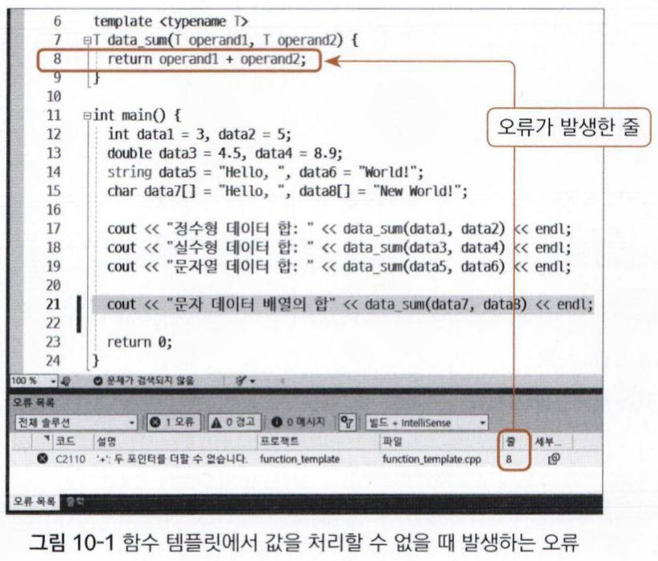

# 10-1. 함수 템플릿

<aside>

**요약**

다양한 데이터 형식에 유연하게 대처할 수 있는 범용 함수를 만드는 방법을 이해하고, 템플릿의 동작 원리, 인스턴스화, 데이터 형식 추론 및 특수화에 대해 학습합니다.

</aside>

# 함수 템플릿으로 범용 함수 만들기

- **함수 템플릿**은 다양한 데이터 형식의 매개변수를 처리할 수 있는 범용 함수를 만들 때 사용된다
- 템플릿을 사용하면 정수, 실수, 문자열 등 **여러 데이터 형식**에 대해 **동일한 알고리즘**을 적용할 수 있으며, 이는 **코드 중복을 줄이고** 함수의 알고리즘 변경에 대한 대응을 용이하게 한다
- 템플릿은 함수 작성 시점이 아닌, **함수를 호출하는 시점**에 매개변수의 데이터 형식을 결정할 수 있도록 한다
- 템플릿 선언 시 `template <typename T>`와 같이 `template` 키워드와 템플릿 매개변수를 사용한다
    - `typename T`에서 `T`는 임의의 데이터 형식을 나타내는 **템플릿 매개변수**
- 함수 템플릿의 본문 정의는 일반 함수와 유사하지만, 데이터 형식 자리에 템플릿 매개변수를 입력한다
- **예시 코드:**
    
    ```cpp
    #include <iostream>
    #include <string>
    using namespace std;
    
    template <typename T> // 템플릿 선언
    T data_sum(T operand1, T operand2) { // 함수 템플릿 정의
        return operand1 + operand2;
    }
    
    int main() {
        int data1 = 3, data2 = 5;
        double data3 = 4.5, data4 = 8.9;
        string data5 = "Hello, ", data6 = "World!";
    
        cout << "정수형 데이터 합: " << data_sum(data1, data2) << endl;
        cout << "실수형 데이터 합: " << data_sum(data3, data4) << endl;
        cout << "문자열 데이터 합: " << data_sum(data5, data6) << endl;
        return 0;
    }
    ```
    

**주의사항**

- 함수 템플릿은 모든 데이터 형식에 대응할 수 있는 **일반적인 알고리즘**으로 정의되어야 한다 
그렇지 않으면 컴파일 오류가 발생할 수 있다
- 예를 들어, `char*` 또는 `char` 배열은 `+` 연산으로 합칠 수 없어 오류가 발생한다



<aside>

🔍 **함수 템플릿이 왜 필요할까?**

- **범용성**
    - 함수 템플릿은 마치 "모든 자료형을 받을 수 있는 만능 틀"과 같음
    - `template <typename T>`라고 선언하면, `T`라는 이름으로 어떤 자료형이든 대신할 수 있게 된다
- **코드 중복 방지**
    - `int`용, `double`용, `string`용 `data_sum` 함수를 따로 만들 필요 없이, 하나의 `data_sum` 템플릿 함수로 모두 처리할 수 있다
- **사용 시점 결정**
    - 일반 함수는 `int`를 받을지 `double`을 받을지 미리 정해야 하지만, 
    템플릿 함수는 **호출하는 순간** (예: `data_sum(3, 5)`처럼 `int`를 넘기면 `T`가 `int`가 되고, `data_sum(4.5, 8.9)`처럼 `double`을 넘기면 `T`가 `double`이 됨) 자료형이 결정된다

**⚠️ 주의할 점**

- 템플릿 함수를 만들 때는 **모든 자료형이 공통적으로 수행할 수 있는 연산**으로 코드를 작성해야한다
- 예를 들어 `int`와 `double`은 `+` 연산이 되지만, C 스타일의 문자 배열(`char[]`)은 `+`로 합칠 수 없기 때문에 템플릿으로 `char[]`를 처리하려고 하면 오류가 발생할 수 있다
- 템플릿은 공통적인 규칙을 일반화하는 도구
</aside>

# 템플릿의 인스턴스화

- **인스턴스화(Template Instantiation)**는 컴파일러가 함수 템플릿을 호출하는 구문을 만나면, 전달된 인자를 바탕으로 템플릿 매개변수의 데이터 형식을 **추론**하고, 해당 형식으로 완성된 함수를 **오브젝트 코드**로 만드는 과정
- 함수와 지역 변수의 스택 메모리 크기가 컴파일 시점에 정해지듯이, 템플릿 매개변수 또한 컴파일 과정에서 실제 데이터 형식으로 대체되어 메모리 크기가 결정되어야 한다
- 템플릿 함수가 여러 데이터 형식으로 호출되면, 컴파일러는 각 데이터 형식에 맞는 **별도의 오브젝트 코드**를 생성한다
    - 예시
    `data_sum(int, int)`, `data_sum(double, double)`, `data_sum(string, string)` 
    세 번 호출 시, 세 개의 `data_sum` 함수가 오브젝트 코드로 만들어짐
- **단점**
    - 템플릿을 많이 사용하면 컴파일 시간이 길어지고 실행 파일의 크기가 커질 수 있음

<aside>

🔍 **템플릿 인스턴스화란?**

컴퓨터는 `template <typename T>` 같은 추상적인 코드를 바로 이해하지 못하기 때문에 **기계어(오브젝트 코드)**로 바뀌어야 실행될 수 있다 → **인스턴스화**는 이 과정을 설명하는 말

템플릿은 "어떤 자료형이든 받아들일 수 있는 설계도"라고 생각하면 됨
건축 설계도처럼, 실제 건물을 짓기 전까지는 그냥 설계도일 뿐임

1. **설계도 (함수 템플릿):** 우리가 `data_sum` 템플릿 함수를 정의함
2. **건축 주문 (함수 호출):** `main` 함수에서 `data_sum(3, 5)` (정수형)이라고 호출하면, 컴파일러는 "아! `int`형 숫자를 더해야 하는구나!" 하고 알아차림
3. **실제 건물 건설 (인스턴스화):** 컴파일러는 `data_sum` 설계도를 가지고, `int`형에 딱 맞는 `int data_sum(int, int)` 함수를 **실제로 만들어낸다**
이 만들어진 함수를 "인스턴스(Instance)"라고 하고, 이 과정을 "인스턴스화"라고 부름 
4. **여러 주문, 여러 건물:** 만약 `data_sum(4.5, 8.9)` (실수형)이라고 호출하면, 컴파일러는 또다시 `double`형에 맞는 `double data_sum(double, double)` 함수를 따로 만들어낸다 `string`도 마찬가지

결국, 우리가 템플릿 함수를 한 번 정의해도, 실제 프로그램이 실행될 때는 사용된 자료형의 수만큼 여러 개의 '실제 함수'들이 만들어진다는 뜻

**왜 알아야 할까?**

- **컴파일 시간:** 템플릿을 너무 많이 사용하면 컴파일러가 만들어야 할 실제 함수들이 많아지므로, 컴파일하는 데 시간이 오래 걸릴 수 있음
- **실행 파일 크기:** 만들어진 실제 함수들은 모두 실행 파일에 포함되기 때문에, 파일 크기가 커질 수도 있다
작은 프로그램에서는 괜찮지만, 아주 큰 프로젝트에서는 이런 점도 고려해야 한다
</aside>

# 데이터 형식 추론과 명시적 호출

- 컴파일러는 함수 템플릿 호출 시 전달된 값을 바탕으로 템플릿 매개변수의 데이터 형식을 **추론한다**
- 형식 추론이 어렵거나 모호하면 컴파일 오류가 발생할 수 있으며, 이는 시간이 많이 소요되는 작업

**명시적 호출(Explicit Call)**
템플릿 매개변수의 데이터 형식을 직접 지정하여 함수를 호출하는 방법

- `data_sum<string>(data7, data8)`와 같이 꺾쇠 괄호 `<>` 안에 데이터 형식을 명시함
- 이를 통해 컴파일러의 형식 추론 없이 지정된 형식으로 변환 후 인스턴스화가 진행됨
- 이는 `char` 배열과 같이 `+` 연산이 지원되지 않는 자료형을 `string`으로 **명시적 형 변환**하여 처리해야 할 때 유용하다

# 템플릿 특수화

- 템플릿 특수화(Template Specialization)는 함수 템플릿이 특정 데이터 형식에 대해서는 **다른 알고리즘**으로 동작하도록 만드는 방법
- 모든 데이터 형식에 대해 일반적인 알고리즘이 작동하지만, 특정 형식에 대해서는 특별한 처리가 필요할 때 사용한다

**명시적 특수화(Explicit Specialization)**

- 모든 템플릿 매개변수를 특정 데이터 형식으로 지정하여 별도의 템플릿을 정의하는 방법
- 함수 템플릿에서는 명시적 특수화만 사용할 수 있다 (클래스 템플릿에서는 부분 특수화도 가능)
- **구조:** `template <>` 키워드 뒤에 특수화할 데이터 형식을 명시한 함수를 정의한다
    - 이때 함수 이름과 매개변수 개수는 원래 템플릿과 동일하게 유지된다
- **예시:** `double`형 인자를 받을 때, `int`로 변환하여 덧셈을 수행하는 특수화된 `data_sum` 함수
    
    ```cpp
    template <> // 특수화임을 나타냄
    double data_sum(double operand1, double operand2) {
        return (int)operand1 + (int)operand2; // double을 int로 변환 후 덧셈
    }
    ```
    
- **활용:** 템플릿 특수화는 특정 데이터 형식에 대해 최적화된 성능을 제공하거나, 해당 형식에서만 필요한 특별한 로직을 구현할 때 유용함
- 템플릿 특수화 대신 별도의 함수를 만들어도 되지만, 목적이 같은 알고리즘을 처리 방법만 다르게 표현하는 것이므로, 템플릿 특수화를 사용하면 코드의 **일관성과 가독성**을 높일 수 있다

<aside>

**템플릿 특수화 vs. 그냥 다른 함수 만들기**

- "그냥 `double`형 전용 `double_sum` 함수를 따로 만들면 되지 않나요?" 라고 생각할 수 있긴함
- 하지만 `data_sum`이라는 **'덧셈'이라는 목적은 동일함**
단지 `double`형일 때만 **처리 방식이 다를 뿐**
- 목적이 같고 맥락이 동일한 코드들을 템플릿 특수화로 묶어두면, 코드의 **일관성**이 높아지고, 나중에 코드를 읽거나 수정할 때 **가독성**이 훨씬 좋아진다
</aside>